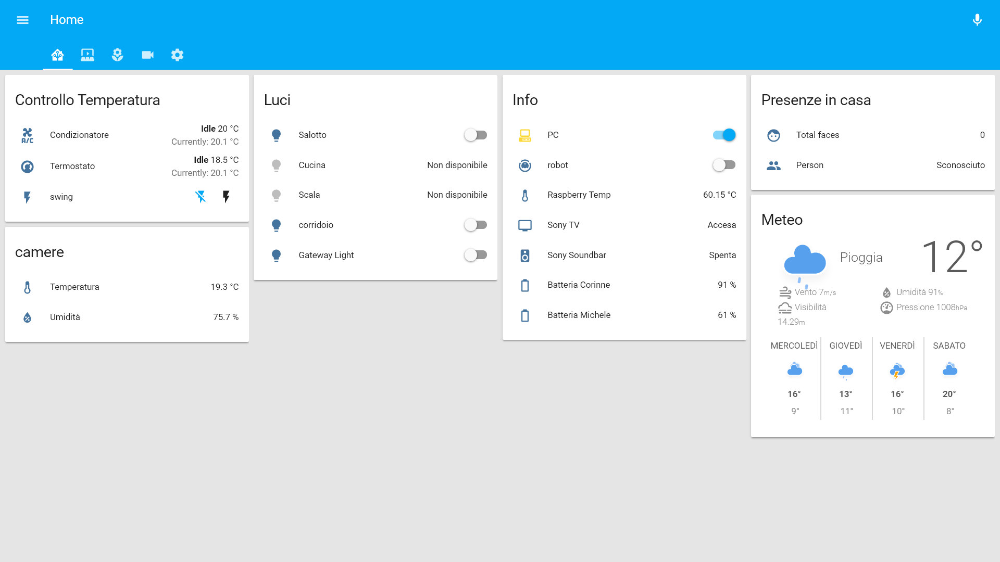
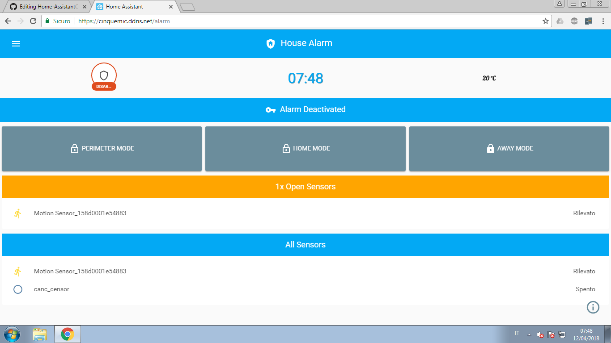
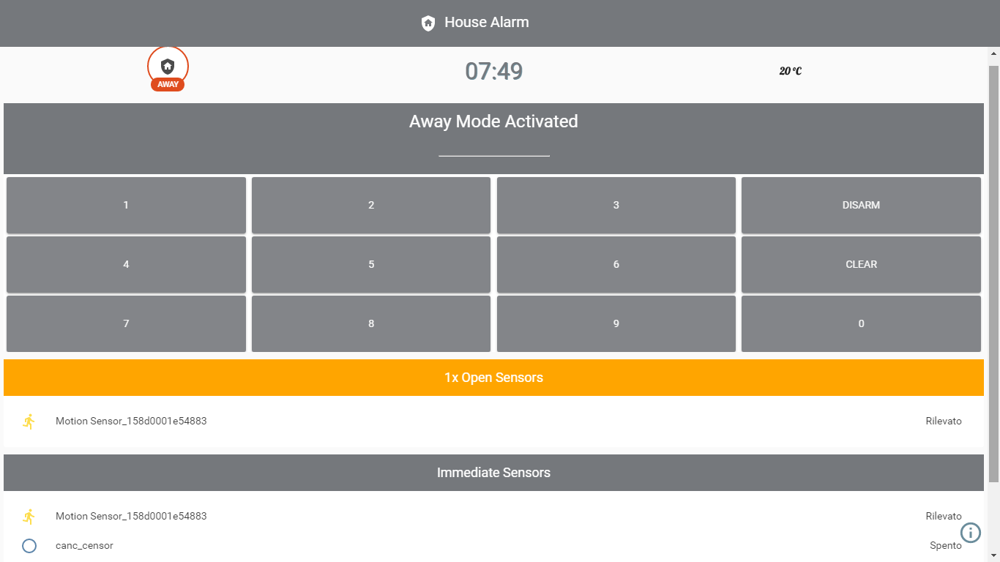

## Configuration

This is my Home Assistant configuration, running on Raspberry Pi3 B.

## Connected Devices

- Google Home
- xiaomi Gateway
- netatmo Thermostat
- Philips Hue Bridge (3 color Light Bulbs)
- Xiaomi Aqara temp. sensor
- Xiaomi Aqara motion sensor
- 2 Sonoff switch ( Tasmota Firmware )
- 1 Xiaomi fang camera ( FangHack modded ) 
- Sony Android TV KD-49X8309C
- Sony Soundbar 
- Broadlink RM Pro

## Presence Detection

OwnTracks connected to MQTT broker.

## Alarm Panel

Alarm Panel from gazoscalvertos https://github.com/gazoscalvertos/Hass-Custom-Alarm
